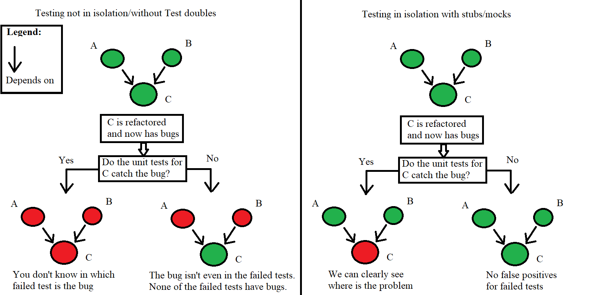

# Unit Testing styles

We need to write automated tests to verify that our application works, test faster than manually typing tests and ensure that previously working code still work. We want to test our units/components/pieces of code/classes/functions(you define the granularity of the unit). However our units always use other units. Just like a car can't work without an engine. So we can either try to isolate them by using testing doubles like mocks and stubs or we can use directly the real depency units of the unit under test and testing doubles only when required.

## Isolation tests

Using mocks and stubs for every dependency.

*   Obvious what is wrong when a test fails.
*   No false positives for failed tests. If a test fails we are 100% sure that there is a bug in the code it tests.
*   Sometimes bugs are found only in Integration with other components/pieces of code and we may not catch these bugs if we test in isolation.
*   When using mocks sometimes tests and implementations are tightly coupled thus changing the implementation forces you to change the tests. If you do TDD(test driven development) you need to think about the implementation while writing the tests.
*   Easier and faster to write(not always).

## Non isolation/Integration tests

Using a real object whenever possible and using testing double like a mock or a stub when it is required or it is hard to use to real depency. For example writing an email. You don't want to send email to random people so you can test your application.

*   Tests how components interact together and work as a whole.
*   A domino of failing tests when a test fails thus it can be harder to find the cause of the problem. Sometimes the problematic code's tests even pass while others that should work fine fail. Most of the cases the problem is in the last thing you edited.
*   Tests much more code and there is bigger chance of finding bugs because they may appear in some of the direct or indirect dependencies(A and B are red even when C is green).
*   Slower to write(not always).

### Conclusion

It's all about personal preference and style. None of the two methods offers 100% protection from errors. Using test doubles for every dependency makes it easier to find the root of the problem but you may miss some bugs. Using the real dependencies when possible has a greater chance of finding that a bug exists but it is harder to find where exaclty is it located.
