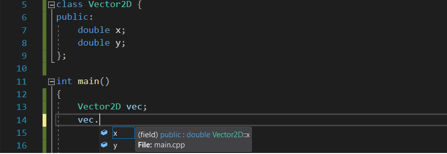
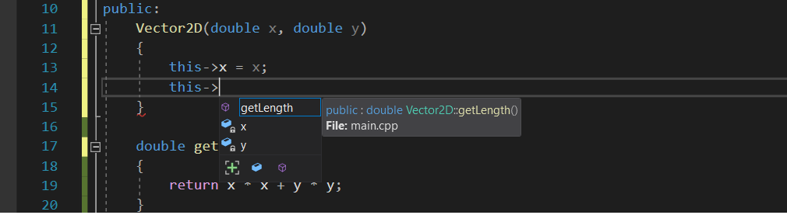

<!-- START doctoc generated TOC please keep comment here to allow auto update -->
<!-- DON'T EDIT THIS SECTION, INSTEAD RE-RUN doctoc TO UPDATE -->
- [Класове](#%D0%BA%D0%BB%D0%B0%D1%81%D0%BE%D0%B2%D0%B5)
  - [Какво наричаме структура](#%D0%BA%D0%B0%D0%BA%D0%B2%D0%BE-%D0%BD%D0%B0%D1%80%D0%B8%D1%87%D0%B0%D0%BC%D0%B5-%D1%81%D1%82%D1%80%D1%83%D0%BA%D1%82%D1%83%D1%80%D0%B0)
  - [Какво наричаме клас](#%D0%BA%D0%B0%D0%BA%D0%B2%D0%BE-%D0%BD%D0%B0%D1%80%D0%B8%D1%87%D0%B0%D0%BC%D0%B5-%D0%BA%D0%BB%D0%B0%D1%81)
    - [Модификатори за достъп (Access modifiers)](#%D0%BC%D0%BE%D0%B4%D0%B8%D1%84%D0%B8%D0%BA%D0%B0%D1%82%D0%BE%D1%80%D0%B8-%D0%B7%D0%B0-%D0%B4%D0%BE%D1%81%D1%82%D1%8A%D0%BF-access-modifiers)
    - [Методи при класовете](#%D0%BC%D0%B5%D1%82%D0%BE%D0%B4%D0%B8-%D0%BF%D1%80%D0%B8-%D0%BA%D0%BB%D0%B0%D1%81%D0%BE%D0%B2%D0%B5%D1%82%D0%B5)
    - [Конструктор I](#%D0%BA%D0%BE%D0%BD%D1%81%D1%82%D1%80%D1%83%D0%BA%D1%82%D0%BE%D1%80-i)
      - [Конструктор по подразбиране(Default Constructor)](#%D0%BA%D0%BE%D0%BD%D1%81%D1%82%D1%80%D1%83%D0%BA%D1%82%D0%BE%D1%80-%D0%BF%D0%BE-%D0%BF%D0%BE%D0%B4%D1%80%D0%B0%D0%B7%D0%B1%D0%B8%D1%80%D0%B0%D0%BD%D0%B5default-constructor)
      - [Разликата между клас и обект](#%D1%80%D0%B0%D0%B7%D0%BB%D0%B8%D0%BA%D0%B0%D1%82%D0%B0-%D0%BC%D0%B5%D0%B6%D0%B4%D1%83-%D0%BA%D0%BB%D0%B0%D1%81-%D0%B8-%D0%BE%D0%B1%D0%B5%D0%BA%D1%82)
    - [Аксесори и Мутатори(Accessors and Mutators)](#%D0%B0%D0%BA%D1%81%D0%B5%D1%81%D0%BE%D1%80%D0%B8-%D0%B8-%D0%BC%D1%83%D1%82%D0%B0%D1%82%D0%BE%D1%80%D0%B8accessors-and-mutators)
      - [Getters](#getters)
      - [Setters](#setters)
    - [Специални методи при класовете](#%D1%81%D0%BF%D0%B5%D1%86%D0%B8%D0%B0%D0%BB%D0%BD%D0%B8-%D0%BC%D0%B5%D1%82%D0%BE%D0%B4%D0%B8-%D0%BF%D1%80%D0%B8-%D0%BA%D0%BB%D0%B0%D1%81%D0%BE%D0%B2%D0%B5%D1%82%D0%B5)
      - [Конструктор I and II (Constructor)](#%D0%BA%D0%BE%D0%BD%D1%81%D1%82%D1%80%D1%83%D0%BA%D1%82%D0%BE%D1%80-i-and-ii-constructor)
      - [Конструктор II - клас с указател](#%D0%BA%D0%BE%D0%BD%D1%81%D1%82%D1%80%D1%83%D0%BA%D1%82%D0%BE%D1%80-ii---%D0%BA%D0%BB%D0%B0%D1%81-%D1%81-%D1%83%D0%BA%D0%B0%D0%B7%D0%B0%D1%82%D0%B5%D0%BB)
        - [Пръв поглед над `DynamicArray`](#%D0%BF%D1%80%D1%8A%D0%B2-%D0%BF%D0%BE%D0%B3%D0%BB%D0%B5%D0%B4-%D0%BD%D0%B0%D0%B4-dynamicarray)
      - [Деструктор (Desctructor)](#%D0%B4%D0%B5%D1%81%D1%82%D1%80%D1%83%D0%BA%D1%82%D0%BE%D1%80-desctructor)
    - [Operator= and Copy constructor](#operator-and-copy-constructor)
      - [Operator=](#operator)
      - [Copy constructor](#copy-constructor)

<!-- END doctoc generated TOC please keep comment here to allow auto update -->

# Класове
Класовете стоят в основата на Обектното-ориентаро програмиране. Те поставят основите върху, които в последствие стъпваме, за да създаме чист, бърз, безопасен и силен код(фикс дис). Идеята на това упражнение е да стъпим върху знанията си за структури като покажем случай, в който структурите не са достатъчно или по-точно случай, в който използването на класове има много повече смисъл. След като обясним какво са класове и защо те биха имали по-голям успех от структурите в дадения случай, ще продължим с имплементационните детайли на класовете - какво са мутаторите - setters and getters, какво са конструктор, деструктор, копи конструктор и оператор= и защо са нужни. През цялото време ще надграждаме даден пример, за да стигнем до желаното решение.

## Какво наричаме структура
Структура е **сложен** тип данни, която може да бъда създадена от вградените типове в езика като `int`, `double`, .. , както и от други структури. Използваме я както вградените типове - създаваме променливи, подаваме на функции и т.н.

## Какво наричаме клас
От гледна точка на C++, структура и клас нямат почти никаква разлика. Тъй като в момента нямаме нужните знания, за да обясним каква е разликата, ще го оставим за после.

Все пак има конвенции, които е хубаво да спазваме, за да можем да говорим на един и същи език с всички други програмисти, които използват C++. Основните разлики в един клас са следните:
 * **Класът** съдържа не само полета, а и функции, които наричаме **методи**
 * Част от полетата и методите са скрити от външния свят
 * Класовете имат два специални метода - **конструктор** и **деструктор**

За хора, които не са виждали код, който използва класове, горните три точки са просто празни думи, нека разгледаме примери какво точно се има предвид. След като имаме някаква бегла представа, че структурите и класове се използват различно, нека видим каква е имплементационната разлика.

### Модификатори за достъп (Access modifiers)

Нека разгледаме следната структура `Vector2D`, която описва вектор в двумерното пространство. Началото на вектора приемаме за координатите `(0,0)`, а краят `(x,y)`.
```c++
struct Vector2D {
    double x;
    double y;
};
```


Използването на структурата отново е просто и ясно, ако искаме да дадем стойност на някое от полетата, използваме **оператор точка**.


Както вече знаем, след като използваме оператор точка, Visual Studio ни показва всички полета, които можем да достъпим, истината обаче е, че имаме достъп до тези полета, само защото използваме структура, а не клас. Ако променим `Vector2D` от структура на клас губим достъпа до `x` и `y`.


Това се случва защото `struct` и `class` имат различни **модификатори за достъп(access modifiers)**, те отговарят за достъпа до полетата и методите на структурите и класовете при тяхното използване.

Това което се случва когато имаме дадената **структура** `Vector2D` е, че се приема автоматично модификатора за достъп при използването на ключовата дума `struct` - `public`.
```c++
struct Vector2D {
public: // <- 'public' access modifiers lets us access all the fields and methods below it.
    double x;
    double y;
};
```
Да пишем `public` в структура е ненужно, тъй като `public` е модификатора по подразбиране за структури. От друга страна модификатора по подразбиране на **класовете** е `private`, той скрива всички полета и методи под него. Това е причината да не можехме да достъпим `x` и `y` когато дефинирахме `Vector2D` чрез `class`.
```c++
class Vector2D {
private:
    double x;
    double y;
};
```

Ако обаче използваме `public` в класът `Vector2D` вече имаме достъп до всички полета и методи под реда, който съдържа `public: `


Нека преди да продължим към следващата част обобщим. Показахме имплементационната разлика между `struct` и `class` - двата модификатора за достъп, `public` и `private`. От сега нататък започваме да пишем наши класове, което означава, че ние сме тези, които ще използват тези модификатори, за **скрием част от полетата и методите на нашия клас**.

### Методи при класовете
Друга основна разлика между стурктурите и класовете е, че класове не се подават на функции, които а работят с тях, а те самите имат дефинирани функции в дефиницията си, наречени **методи**
Нека разгледаме прост пример за тази разлика, ако **трябваше да добавим функционалност, която намира дължината на даден вектор, то за структура резултатът би бил следния

```c++
struct Vector2D {
    double x;
    double y;
}

double getLength(Vector2D vector)
{
    return vector.x * vector.x + vector.y * vector.y;
}

int main()
{
    Vector2D vec = { 5, 5 };
    double vecLength = getLength(vec);

    return 0;
}
```

От друга страна класовете вече ще съдържат тази функция вътре в себе си, разликата става голяма - **данните и функциите, които работят върху тях вече са на едно място, класът става затворена система и неговото използвате става само чрез публичните полета и методи, които той предоставя**.

```c++
class Vector2D {
public:
    double x;
    double y;

    double getLength()
    {
        return x * x + y * y;
    }
};

int main()
{
    Vector2D vec = { 5,5 };
    double vecLength = vec.getLength();

    return 0;
}
```
### Конструктор I
Конструкторът е една от специалните функции, които се свързват с живота на дадена променлива. Той се изпълнява само при създаване на променлива. Конструкторите могат да изпълняват 2 функции, сега ще разгледаме първата, която е по-проста , а по-надолу ще обясним втората.

Тъй като идеята на класовете е да енкапсулират данни, няма смисъл да правим клас, на който всички полета и методи са публични. Нека да приемем, че задачата, която решаваме изисква от нас полетата на класа `Vector2D` да са скрити и хората, които използват нашия клас да нямат пряк достъп до тях. Тогава можем просто да използваме комбинация от двата модификатора за достъп - `private` и `public`, за да постигнем желания резултат.


Резултатът е следния, вече сме скрили двете полета, както можем да видим на картинката, когато използваме оператор точка, нямаме достъп до тях. Това е проблемно тъй като вече никой не може да даде стойности на `x` и `y`. Техните стойности не са ясни, използването на променливата `vec` може да доведе до `undefined behavior`. Един начин да решим този проблем е да създадем конструктор, които дава стойности на нашата променлива при нейното създаване.
```c++
class Vector2D {
private:
    double x;
    double y;
public:
    Vector2D(double x, double y)
    {
        this->x = x;
        this->y = y;
    }

    double getLength()
    {
        return x * x + y * y;
    }
};

int main()
{
    Vector2D vec = Vector2D(5, 5); // Same as Vector2D vec(5, 5);
    double vecLength = vec.getLength();

    return 0;
}
```

Конструкторът е метод, който има **съшото** име както класът, по този начин C++ успява да разпознае кой метод е конструктора и го изпълнява при създаването на променливата. Конструкторът по нищо не се различава от обикновена функция освен името и това, че полетата на класа не са инициализирани, това означава, че конструкторът е мястото, където ние трябва да дадем стойности на нашите скрити полета. Също се вижда използването на още една нова ключова дума - `this`, всеки клас има `this`, нека първо да видим какво става когато използваме `this->`



`this` е просто указател към самия клас, това е причината да трябва да използваме `->` вместо `.`, чрез `this` имаме достъп до всички полета и методи, без значение дали са `private` или `public`. Това е така защото тази ключова дума съществува само в дефиницята на класа, не можем да я използваме в **обект** от този клас. Ще обясним връзката между **обект** и **клас** много скоро. За сега можехме просто да използваме други имена за параметрите на класа, тъй като текущите създаваха конфликти с вече дефинираните полета и да не използваме `this`, но тази ключова дума ще е много полезна по-надолу. Използването на конструктора е малко по-различно от обичайното, C++ позволява използването на конструктори по много начини, показани са 2 от тях.

#### Конструктор по подразбиране(Default Constructor)
Един проблем, който възниква в момента е, че не можем да имаме този ред код в нашата програма, тъй като всъщност този ред извиква **конструктора по подразбиране** на класа `Vector2D`.
```c++
Vector2D vec;
```

**Конструкторът по подразбиране** е просто конструктор, който не приема никакви параметри, тъй като вече ние сме дефинирали един конструктор, който приема 2 параметъра, ако искаме да използваме този ред код, трябва сами да създадем конструктора по подразбиране, които по принцип C++ създава вместо нас.
```c++
class Vector2D {
private:
    double x;
    double y;

public:
Vector2D()
{
    x = 0;
    y = 0;
}

Vector2D(double x, double y)
{
    this->x = x;
    this->y = y;
}

};
```
Можем да имаме колкото конструктора искаме, стига да не съвпадат всичките им параметри. В този случай можем да използваме функционалност, която C++ ни предлага - **стойности по подразбиране за параметри на функция**. По този начин можем директно да си спестим един конструктор, ако не се подадът стойности за `x` и `y`, те автоматично ще са със стойности `0`.
```c++
class Vector2D {
private:
    double x;
    double y;

public:

Vector2D(double x = 0, double y = 0)
{
    this->x = x;
    this->y = y;
}

};

int main()
{
    Vector2D vecOne; // vecOne.x == 0 and vecOne.y == 0
    Vector2D vecTwo(5, 5); // Both are 5.
}
```

Казахме, че конструкторът е специална функция, която се извиква при създаването на даден обект. Също казахме, че конструкторът има същото име както и класа, споменахме че можем да имаме повече от един конструктор и обяснихме какво се случва когато дефинираме наш конструктор - конструкторът по подразбиране изчезва и трябва да го дефинираме сами, ако искаме да създаваме променливи чрез него. Завършихме с една оптимизация, която намалява кода, който пишем и комбинира няколко конструктора в един чрез използването на параметри по подразбиране.

За съжаление текушата ситуация ни поставя пред проблема, че в момента не можем да променяме стойностите на нашите променливи - те са скрити чрез `private` модификатора, единствения начин е да създаваме нови променливи. Решението на този проблем са аксесорите и мутаторите, които са малко по-надолу, преди да продължим към тях, нека първо кажем каква е разликата между **клас** и **обект**.

#### Разликата между клас и обект
Можем да мислим за разликата между двете точно по същия начин както бихме мислили за разликата между **blueprint** на къща и самите **къщи**. Blueprint-а e клас, той само описва какво ще съдържа самата къща, без да дава детайли. От друга страна отделните къщи, наредени една до друга, изглеждащи еднакво, но все пак малко различни са самите обекти.

Друг още по прост пример би бил класът `Person`, които описва човек. От своя страна обектите биха били инстанции на този клас - `pesho`, `yasen`, `krasen`, ...


### Аксесори и Мутатори(Accessors and Mutators)
Това са методи, които имат за цел да достъпват и променят скритите полета на даден клас. Друго име, което често се използва за тях са - **setters** и **getters**. Сетърите отговарят за това да задават стойности на полетата, а гетърите да вземат тези стойности, без да ги променят.
```c++
class Vector2D {
private:
    double x;
    double y;

public:

    double getX() const
    {
        return x;
    }

    double getY() const
    {
        return y;
    }

    void setX(double newX)
    {
        x = newX;
    }

    void setY(double newY)
    {
        y = newY;
    }

    double getLength()
    {
        return x * x + y * y;
    }
};

int main()
{
    Vector2D vec;
    vec.setX(5);
    vec.setY(5);
    double vecLength = vec.getLength();
    std::cout << vec.getX() << std::endl;

    return 0;
}
```

В повечето случаи няма да предоставяме достъп до всички скрити полета, тъй като това убива самата идея да ги скриваме. Тук сме показали сетъри и гетъри и за двете полета, тъй като примера е обучителен.
Нека разгледаме сетърите и гетърите по отделно.

#### Getters
```c++
double getX() const
{
    return x;
}
```

Гетърите са просто методи, които връщат стойността в дадено поле, единственото ново нещо, което е непознато е използването на ключовата дума `const` между кръглите и къдравите скоби. `const` е ключова дума, която използвана по този начин "съобщава" на компилатора и други програмисти, които виждат/използват този код, че функцията `getX` не променя полетата на класа.

#### Setters
```c++
void setX(double newX)
{
    x = newX;
}
```

Сетърите се грижат за това да дават нови стойности на скрити полета от даден клас, по тази причина те не връщат нищо - `void`.  Тяхната функция обаче може да не е само просто присвояване, а и валидация, например ако искахме нашата точка да може да приема само положителни стойности за `x`, като сме решили, че ако някой подаде отрицателна стойност, ще слагаме стойност `0` вместо нея, кодът ни би изглеждал по следния начин
```c++
void setX(double newX)
{
   x = newX > 0 ? newX : 0;
}
```

Сетърите са също мястото където се хвърлят **изключения(exceptions)**, но за това ще говорим по-нататък.

### Специални методи при класовете
Има два специални метода, които се свързват директно с живота на променливата, чиито тип е някакъв наш дефиниран клас. Те се наричат **конструктор(constructor)** и **деструктор(destructor)**. Телата на тези два специални метода се изпълняват при създаване на променливата и съответно при нейното унищожаване.

#### Конструктор I and II (Constructor)
Конструкторът е специалният метод, който се извиква при създаването на променливата. Той има две много различни функции спрямо какви полета има нашият клас.
 1. Да иницилиализира всички полета в този клас с някакви стойности по подразбиране, например `0` за двете полета на нашия `Vector2D`. - вече говорихме за това в Конструктор I
 2. Да заделя динамична памет, в случайте когато класът има поле, което е указател.

#### Конструктор II - клас с указател
От тук нататък ще започнем да разгледаме друг пример. Задачата ни е да направим клас `DynamicArray`, който работи с цели числа, уголемява се сам при нужда и ни позволява следните функционалности:
 * да добавяме ново число към масива - `void add(int number)`
 * да проверяваме дали дадено число е в масива - `bool contains(int number)`
 * да показваме масива в конзолата - `void print()`

##### Пръв поглед над `DynamicArray`
`DynamicArray` е клас, който ще предоставя функционалност, която съответства на изискванията, класът е затворена система, не искаме никой да може да достъпва нашия масив, който съдържа самите числа, това е просто имплементационен детайл, важното е човекът, който използва `DynamicArray` да има достъп само до релевантната функционалност. За тази цел скриваме самия масив и неговия размер чрез `private` модификатора и оставяме само трите функции за работа от външния свят. Така изглежда `header` файла на `DynamicArray` на пръв поглед, за съжаление не можем да правим нищо специално с него, тъй като все още не сме имплементирали никакви методи. Още преди да започнем да използваме методите на самия клас, трябва да се погрижим, че обектите на този клас ще се създават правилно и ще се грижат за динамичната памет.

```c++
// DynamicArray.hpp
#pragma once

class DynamicArray {
private:
    int* numbers;
    size_t size;

public:
    void add(int number);
    bool contains(int number) const;
    void print() const;
};
```

Първото нещо, което ще направим е да създадем конструктор, които заделя динамична памет. За тази цел трябва да добавим още едно поле, което да пази максималния брой елементи - `capacity`, както и конструктор, които приема параметър `capacity`, задава тази стойност на полето `capacity` и заделя динамичната памет. `.hpp` файла ни вече изглежда така
```c++
#pragma once

class DynamicArray {
private:
    size_t capacity;
    size_t size;
    int* numbers;

public:
    DynamicArray(size_t capacity = 16);
    void add(int number);
    bool contains(int number) const;
    void print() const;
};
```

```c++
// DynamicArray.cpp
#include "DynamicArray.h"

DynamicArray::DynamicArray(size_t capacity)
{
    this->capacity = capacity;
    numbers = new int[capacity];
    size = 0;
}
```

Тук вече можем да създадем обект от този клас.
```c++
#include <iostream>

#include "DynamicArray.hpp"

int main()
{
    DynamicArray numbers = DynamicArray();

    // delete[] numbers.numbers; <- can't do that, we don't have access.
    return 0;
}
```
Проблемът с този код е, че дори и да можехме да добавяме числа чрез `numbers.add(5)`, не изтриваме паметта след нас - използвали сме `new[]` при създаването, но не използваме `delete[]`. Не можем да изтрием масива, които е поле в класа, тъй като той е `private`. Решението на този проблем е `destructor` - другия специален метод, който се изпълнява когато обекта се разрушава. В момента, в който стигнем затварящата къдрава скоба на `main()`, ще се изпълни деструктора на този клас и ще можем да извикаме `delete[]`, нека видим как става това.

#### Деструктор (Desctructor)
Деструктора е специален метод, който се изпълнява когато даден обект(мислим си променлива) се унищожи(когато излезе извън **scope**). За да дефинираме конструктор трябва да дефинираме метод, който има същото име както класа и `~` пред него. Деструктора на `DynamicArray` би имал следната декларация - `void ~DynamicArray()`. Нашият `header` файл с деклариран конструктор и деструктор вече изгледат така
```c++
#pragma once

class DynamicArray {
private:
    size_t capacity;
    size_t size;
    int* numbers;

public:
    DynamicArray(size_t capacity = 16);
    void add(int number);
    bool contains(int number) const;
    void print() const;
    ~DynamicArray();
};
```
В дефиницията на деструктора просто изтриваме динамичната памет, тъй като знаем, че това е последният момент преди да сме загубили указателя към нея.
```c++
// DynamicArray.cpp
#include "DynamicArray.hpp"

DynamicArray::DynamicArray(size_t capacity)
{
    this->capacity = capacity;
    numbers = new int[capacity];
    size = 0;
}

DynamicArray::~DynamicArray()
{
    delete[]  numbers;
}
```

Вече този код няма да **leak-ва** динамична памет.
```c++
#include <iostream>

#include "DynamicArray.hpp"

int main()
{
    DynamicArray numbers = DynamicArray();

    return 0;
}
```

Нека добавим дефинициите на трите функции и да видим как работи.
```c++
// DynamicArray.hpp
#pragma once

#include <iostream>

using std::cout;
using std::endl;

class DynamicArray {
private:
    size_t capacity;
    size_t size;
    int* numbers;

    void copyArray(int* destination, int* source, const size_t& sourceSize);
    void increaseCapacity();
public:
    DynamicArray(size_t capacity = 16);
    void add(int number);
    bool contains(int number) const;
    void print() const;
    ~DynamicArray();
};

```

```c++
// DynamicArray.cpp
#include "DynamicArray.hpp"

DynamicArray::DynamicArray(size_t capacity)
{
    this->capacity = capacity;
    numbers = new int[capacity];
    size = 0;
}

void DynamicArray::add(int number)
{
    if (size >= capacity)
    {
        if(!this->increaseCapacity())
        {
        	std::cerr << "Not enough memory!" << std::endl;
        }
    }

    numbers[size] = number;
    size++;
}


bool DynamicArray::contains(int number) const
{
    bool result = false;
    for (size_t i = 0; i < size; i++)
    {
        if (numbers[i] == number)
        {
            result = true;
            break;
        }
    }

    return result;
}

void DynamicArray::print() const
{
    for (size_t i = 0; i < size; i++)
    {
        cout << numbers[i] << " ";
    }

    cout << endl;
}

DynamicArray::~DynamicArray()
{
    delete[]  numbers;
}

bool DynamicArray::increaseCapacity()
{
    bool result	=	false;
    capacity *= 2;
    int* numbersCopy = new (std::nothrow) int[capacity];
    if ( numbersCopy )
    {		
        copyArray(numbersCopy, numbers, size);
        delete[] numbers;
        numbers = numbersCopy;
        result true;
    }
    else
    {
        capacity /= 2;
    }
	
    return result;
}

void DynamicArray::copyArray(int* destination, int* source, const size_t& sourceSize)
{
    for (size_t i = 0; i < sourceSize; i++)
    {
        destination[i] = source[i];
    }
}

```

Вече можем да използваме нашият клас, да добавяме колкото искаме числа и всичко работи автоматично, при нужда масивът се уголемява, а при излизане от функцията, която използва нашия обект, паметта се освобождава.
```c++
#include <iostream>

#include "DynamicArray.hpp"

int main()
{
    DynamicArray numbers = DynamicArray(4);

    for (int i = 0; i < 1024; i++)
    {
        numbers.add(i);
    }

    numbers.print();
    return 0;
}

```

За съжаление все още имаме пропуски, нека разгледаме какво ще направи следният код
```c++
#include <iostream>

#include "DynamicArray.hpp"

int main()
{
    DynamicArray numbers = DynamicArray(4);
    if (numbers.contains(5))
    {
        cout << "Yes" << endl;
    }
    else
    {
        DynamicArray copy;
        copy = numbers;
        copy.add(5);
    }

    numbers.print();
    return 0;
}
```
Проблемът идва от `copy`, нека помислим какво точно прави присвояването. Тъй като тези два обекта са от един и същи клас, това което се случва е просто всички полета на `copy` да се инициализират със стойностите от `numbers`. Но `copy` има различен **scope** и при излизане от `else` се извиква неговия конструктор, който освобождава паметта, към която сочи `private` указателя, за наше нещастие, `numbers` сочи към същата памет, тоест ** когато работим с указатели и копираме обекти, се копира просто адреса в паметта, което създава проблеми, защото вече 2 обекта споделят една и съща динамична памет**. Решението на този проблем е да предефинираме `operator=` така че, вместо да копира просто адреса, всеки нов обект да заделя нова динамична памет, която той лично да използва.

### Operator= and Copy constructor
Кодът след като добавихме оператор=, вече горния main работи правилно и програмата не спира заради exception.
```c++
// DynamicArray.hpp
#pragma once

#include <iostream>

using std::cout;
using std::endl;

class DynamicArray {
private:
    size_t capacity;
    size_t size;
    int* numbers;

    void copyArray(int* destination, int* source, const size_t& sourceSize);
    bool increaseCapacity();
public:
    DynamicArray(size_t capacity = 16);
    ~DynamicArray();
    DynamicArray& operator=(const DynamicArray& other);
    void add(int number);
    bool contains(int number) const;
    void print() const;
};
```

```c++
// DynamicArray.cpp
#include "DynamicArray.hpp"

DynamicArray::DynamicArray(size_t capacity)
{
    this->capacity = capacity;
    numbers = new int[capacity];
    size = 0;
}

void DynamicArray::add(int number)
{
    if (size >= capacity)
    {
        if(!this->increaseCapacity())
        {
        	std::cerr << "Not enough memory!" << std::endl;
        }
    }

    numbers[size] = number;
    size++;
}

bool DynamicArray::contains(int number) const
{
    bool result = false;
    for (size_t i = 0; i < size; i++)
    {
        if (numbers[i] == number)
        {
            result = true;
            break;
        }
    }

    return result;
}

void DynamicArray::print() const
{
    for (size_t i = 0; i < size; i++)
    {
        cout << numbers[i] << " ";
    }

    cout << endl;
}

DynamicArray::~DynamicArray()
{
    delete[]  numbers;
}

DynamicArray& DynamicArray::operator=(const DynamicArray& other)
{
    if (this != &other)
    {
        int* copy = new (std::nothrow) int[other.capacity];
        if(copy)
        {
            this->copyArray(copy, other.numbers, other.size);
            delete[] numbers;
            numbers = copy;
            size = other.size;
            capacity = other.capacity;
        }
    }

    return *this;
}

bool DynamicArray::increaseCapacity()
{
    bool result = false;
    capacity *= 2;
    int* numbersCopy = new (std::nothrow) int[capacity];
    if ( numbersCopy )
    {		
        copyArray(numbersCopy, numbers, size);
        delete[] numbers;
        numbers = numbersCopy;
        result true;
    }
    else
    {
        capacity /= 2;
    }
	
    return result;
}

void DynamicArray::copyArray(int* destination, int* source, const size_t& sourceSize)
{
    for (size_t i = 0; i < sourceSize; i++)
    {
        destination[i] = source[i];
    }
}

```

#### Operator=
TODO: Explain all the stuff behind operator=

#### Copy constructor
TODO:Explain all the stuff behind copy constructor
