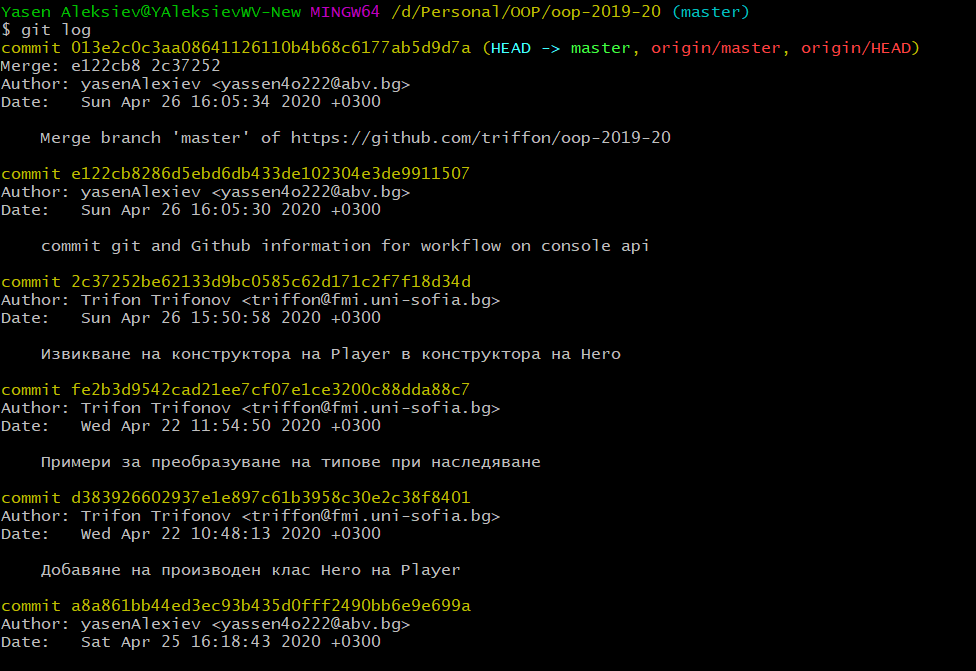
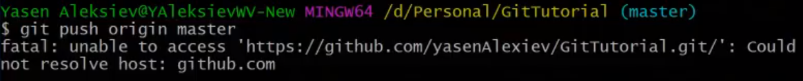
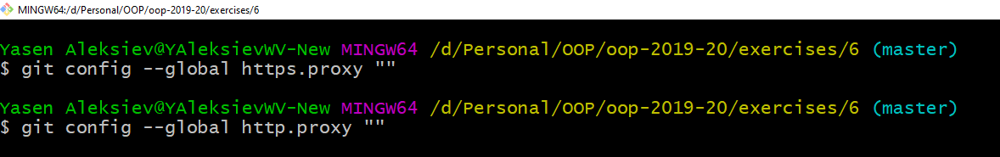
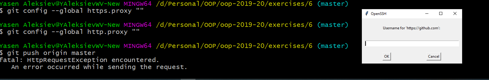
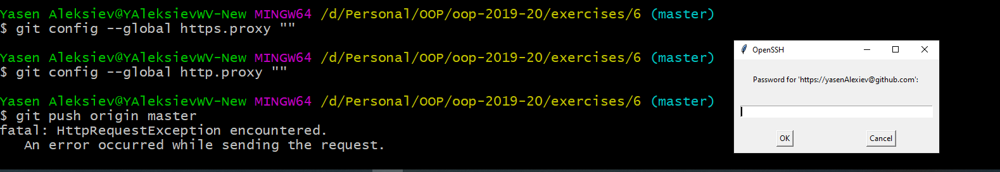
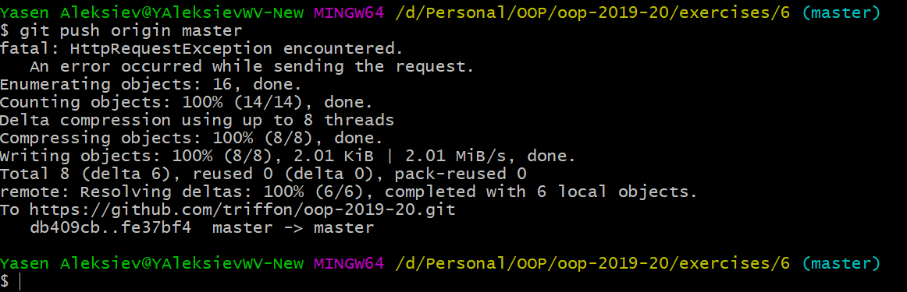
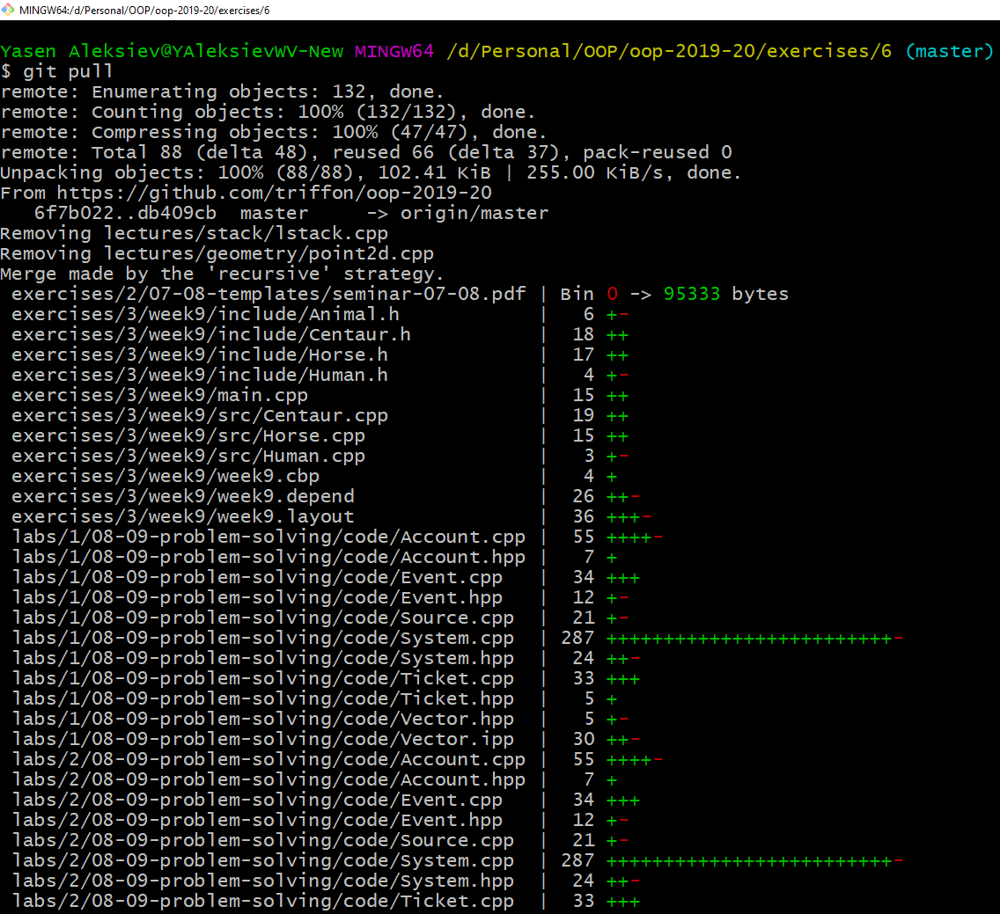
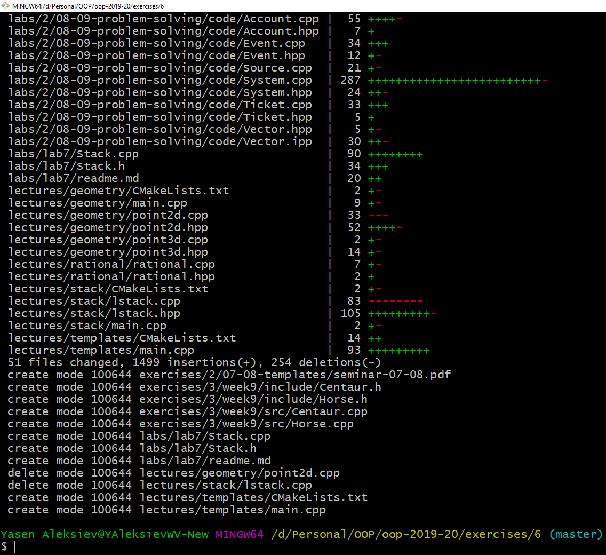

# git and Github

1. Ако не сте гледали семинара на живо, може да гледате запис на следния линк: [**запис**](https://drive.google.com/drive/folders/0B2mK2PokkjqTfmk2ZjhhVDBwNWVhVEd6bnU4SFlES2loQ0hhcHVRSGVsZDA2Q0ZjNkY0dXM)

2. Кратко разсяснение какво прави всяка една от показаните команди:
	* **git --version** - показва ви версията на git, инсталиран на машината ви. Ако нямате git, ще ви изпише грешка.

	## За локално хранилище имаме следните команди:
	* **git init** - инициализира папката в която се намирате, като git хранилище. Това означава, че папката ви започва да се следи от git. 
	* **git status** - след като промените нещо в папката, която се следи от git (от тук нататък ще я наричаме repo, съкратено от repository), независимо каква е промяната - създаване на нов файл, промяна във вече съществуващ файл, изтриване на файл, създаване на папка, изтриване на папка. Тази команда ще ви даде информация за текущото състояние на repo-то.
	* **git add <име на файл/ имена на файлове разделени със спейс/ име на папка>** - командата добавя файл/файлове в едно междинно състояние в което казвате, че тези файлове са готови за проследяване от git и са готови за commit.
	* **git commit** - създава нов commit с промените по файловете добавено чрез git add. Ако напишете само git commit това ще отвори текстовия редактор по подразбиране, който сте избрали при инсталация. Там ще може да напишете message, който отговаря на промените по файловете. **Не може съобщението да е празно!** Ако искате и по-просто писане на съобщението за commit, можете да добавите -m"Message for current commit" след git commit - **git commit -m"Commit message"**. Така няма да бъде отворен текстовия редактор, но съобщението ще бъде добавено.
	* **git log** - след като поне един път сте къмитнали, с тази команда може да видите информация за всички къмити направени до сега.
	
	* **git chechout < commit-hash>** - за да може да се връщате или в общия случай да отивате до даден commit, можете да го направите с тази команда, като commit-hash на всеки commit можете да видите с предишната команда. Той предтавлява нещо такова **9f9cfb9ad5dd11694f533ebea2a398936191a858**. За всеки commit е различно. Когато изпълнявате тази команда, copy-paste-вайте хеша, не го пишете на ръка!
	* **git checkout master** - същото като горната команда, но master винаги "сочи" към последния(най-новия хронологично) commit
	* **.gitignore** - това е файл, не е команда, в който може да си напишем имена на файлове и/или папки (или темплейти на файлове), които не искаме да се включват в тази междинна стъпка при git add. Пример за такъв файл, може да видите в това хранилище [**тук**](https://github.com/triffon/oop-2019-20/blob/master/.gitignore)
	* **git branch < new-branch-name>** - командата създава нов branch с подаденото име(ако такъв не съществува). Branch-a е копие(отлонение) на този branch в който се намирате, когато правите тази команда. Първоначално задължително имате един branch с име master.
	* **git checkout < branch-name>** - команда, която ви позволява да се "прехвърлите" на съществуващ branch. 
	* **git chechout -b < new-branch-name>** - тази команда е съвкупсност от предишните две. Създава нов branch с подаденото име и се "прехвърляте" на него веднага
	* **git checkout master** - аналогично на къмитите, може да се "прехвърлите" на master branch-a с тази команда
	* **git merge < branch-name>** - команда, която събира два branch-a. Ако направите тази команда докато сте в branch1(примерно име на някой ваш бранч) и подадете < branch-name> да е branch2(примерно име на някой друг наш съществуващ бранч), това ще събере всички промени, които ги няма в branch1, но са в branch2 и ще се опита да ги сложи в branch1. **Внимание, при тази команда може да има така наречените merge conflicts, за което не стигнахме да говорим на семинара, но може да покажем в последния семинар.**
	* **git branch -d < branch-name>** - тази команда изтрива branch-а с подаденото име. Обикновенно след git merge, branch-a от който сме взели промените, може вече да не искаме да го използваме, за това може да го изтрием. Разбира се това не е задължително, защото може да продължим да го ползваме и да merge-ваме периодично от него към основния brach. Триене на бранч може да стане по всяко време, дори и да има промени, които не са никъде другаде. Тези промени ще се загубят при триене на branch-a.

	## За отделечено(remote) хранилище, което се намира в Github
	* Прочетете и изпълнете нещата от [**този линк**](https://www.notion.so/Introduction-to-GitHub-202af6f64bbd4299b15f238dcd09d2a7)
	* Разяснения за същите неща съм направил и на семинара.
	* Когато стигнете до командата **git remote add origin https://github.com/< your-username>/< your-repo-name>.git**, както направихме и на упражнението, вече имате връзката между локалното си хранилище и това в Github. Следващата команда, която трябва да направите е:
	* **git push -u origin master** - тази команда казва да се качат всички разлики в кода от локалното към отдалеченото хранилище.
	На семинара аз имах проблем с тази команда и даваше тази грешка:
	
	Намерих решение на следния [**линк**](https://stackoverflow.com/questions/50996912/could-not-resolve-proxy-git-clone/51016837). Въпроса който е зададен е за малко по-различен проблем, но след като прочетох, че git си има свое proxy(някой друг път за това), просто го рестартирах така:
	
	* Ако и вие сте имали същия проблем и сте си го решили по този начин, може пак да пробвате командата git push origin master и би трябвало да ви покаже следния диалогов прозорец:
	
	Въведете си username-a с който сте се регистрирали в Github. След това бутона ОК или просто Enter.
	След това пак трябва да се покаже същия прозерец, този път искащ парола:
	
	Въведете паролата с която сте се регистрирали в Github. След това бутона ОК или просто Enter.
	Ако всичко е правилно, трябва да имате в конзолата следния текст:
	
	Тези диалози ще ви се появят само първия път, следващите пъти ssh-ча е конфигуриран и ще се свързвате с отдалеченото хранилище автоматично.
	Рефрешнете страницата в браузъра си, която е за Github хранилището ви. Ако всичко е успешно, вече виждате кода си там. :)

3. Други действия, които може да правите, когато имате remote хранилище
	* **git pull** - команда, която синхронизира промените от remote хранилището към вашето локално. Или по друг начин казано - взима промените които нямате от remote хранилището и ви ги предоставя в локалното. Когато работите сами в едно хранилище, вие няма да имате нужда от тази команда, защото винаги локалното ви хранилище ще е по-напред с промените отколкото remote хранилището и ще ви се налага само git push. Обаче доста по-вероятно в бъдеще да ви се налага да работите с хора по общ проект. Тогава всяко едно локално хранилище на всеки [**contributor**](https://github.blog/2013-01-07-introducing-contributions/), трябва да бъде сихноризирано с remote хранилището. Когато други contributor-и push-ват към remote хранилището, то избързва с промените, които те правят. За да може и вие да ги имате при вас на локалното хранилище, трябва да направите командата git pull. Например в това хранилище правим промени всички асистенти и лектора. Когато не съм свалял промените от някакво време и има други в remote хранилището, които аз ги нямам, git pull командата ще излежда така:
	
	
	**Внимание! Правете тази команда задължително след като сте къмитнали промените си и преди да push-нете. Или няма да ви даде да pull-нете преди да сте къмитнали, или ще pull-нете и ще изгубите промените си, защото тях ги няма в remote хранилището.**
	* **git clone https://github.com/< your-username>/< your-repo-name>.git** - ако нямате локално хранилище, което сте си направили с командата git init, но имате remote хранилище в Github, може да клонирате това remote хранилище и да го имате като локално такова. Ако това хранилище е ваше или сте contributor в него, може да push-вате и pull-вате спокойно. Обаче, ако не сте, пак може да го клонирате, но за да качите вашия код и да се вижда в Github, трябва да се направи pull request(за това също може да разкажем в последния семинар).

4. Има много други команди с които може да се сблъскате, но това са основните, с които може да си служите за сега и да работите спокойно с git и Github.

Приятно ползване :)